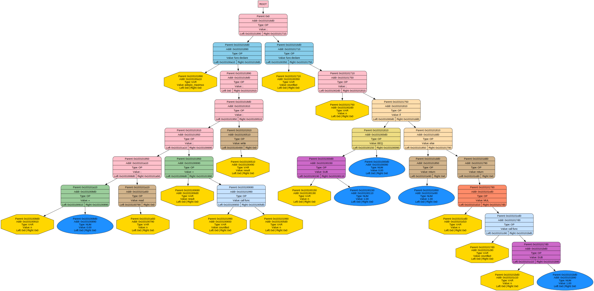

# Lingua Romana Programmandi (Latin Programming Language)

## 📋 Содержание
- [Описание](#краткое-описание)
- [Функционал](#функционал)
- [Синтаксис и команды](#синтаксис)
  - [Математические операции](#математические-операции)
  - [Математические функции](#математические-функции)
  - [Условное и циклическое выполнение](#условное-и-циклическое-выполнение)
  - [Операторы присваивания и сравнения](#oператоры-присваивания-и-сравнения)
  - [Ввод-вывод](#ввод-вывод)
  - [Функции и управление программой](#функции-и-управление-программой)
  - [Синтаксические конструкции](#cинтаксические-конструкции)
- [Пример программы](#пример-программы)


## 📄 Описание

В моем языке программирования реализованы 3 программы:

- решатель квадратных уравнений


- подсчет факториала


- рисовальщик круга


По каждой из них строится дерево команд. 

Любые два конечных выражения связываются друг с другом при помощи ';' (в дереве) и '~~' (в коде).

## 🧩 Функционал
### Front-End 
- code -> tree
- code -> asm
- tree -> asm

### Reverse-End
- tree -> code

### Middle-End 
- optimise tree

### Back-End (в репозитории под названием "Processor")

## 📚 Синтаксис и команды

### 🔢 **Математические операции**

| Латинская команда | Символ | Описание | Пример |
|-------------------|--------|----------|---------|
| **augeo** | `+` | Сложение | `x augeo y` → `x + y` |
| **minuo** | `-` | Вычитание | `x minuo y` → `x - y` |
| **multiplico** | `*` | Умножение | `x multiplico y` → `x * y` |
| **divido** | `/` | Деление | `x divido y` → `x / y` |
| **^** | `^` | Возведение в степень | `x ^ y` → `xʸ` |
| **sqrt** | `sqrt` | Квадратный корень | `sqrt x` → `√x` |

### 📐 **Математические функции**

| Команда | Описание | Пример |
|---------|----------|---------|
| **sin** | Синус угла | `sin(angulus)` |
| **cos** | Косинус угла | `cos(angulus)` |
| **tg** | Тангенс угла | `tg(angulus)` |
| **ln** | Натуральный логарифм | `ln(numerus)` |
| **arctg** | Арктангенс | `arctg(valor)` |
| **sh** | Гиперболический синус | `sh(x)` |
| **ch** | Гиперболический косинус | `ch(x)` |
| **th** | Гиперболический тангенс | `th(x)` |

### 🔄 **Условное и циклическое выполнение**

| Команда | Аналог в C | Описание | Пример |
|---------|------------|----------|---------|
| **si** | `if` | Условный оператор | `si (conditio) \|> ... <\|` |
| **altius** | `else` | Альтернативная ветка | `si (x) \|> ... <\| altius \|> ... <\|` |
| **perpetuum** | `while` | Цикл "пока" | `perpetuum (conditio) \|> ... <\|` |

### 📝 **Операторы присваивания и сравнения**

| Команда | Символ | Описание | Пример |
|---------|--------|----------|---------|
| **magica** | `=` | Присваивание | `x magica 5` → `x = 5` |
| **inferior** | `<` | Меньше | `x inferior y` → `x < y` |
| **inferior_aut** | `<=` | Меньше или равно | `x inferior_aut y` → `x <= y` |
| **superior** | `>` | Больше | `x superior y` → `x > y` |
| **superior_aut** | `>=` | Больше или равно | `x superior_aut y` → `x >= y` |
| **aequalis** | `==` | Равно | `x aequalis y` → `x == y` |
| **!=** | `!=` | Не равно | `x != y` → `x != y` |

### 💬 **Ввод-вывод**

| Команда | Аналог в C | Описание | Пример |
|---------|------------|----------|---------|
| **revelatio** | `printf` | Вывод на экран | `revelatio(arg)` |
| **printc** | `putchar` | Вывод символа | `printc(arg)` |
| **augurio** | `scanf` | Ввод с клавиатуры | `augurio(arg)` |

### 🏗️ **Функции и управление программой**

| Команда | Аналог в C | Описание | Пример |
|---------|------------|----------|---------|
| **incantatio** | `func` | Объявление функции | `incantatio nomen() \|> ... <\|` |
| **call** | вызов функции | Вызов функции | `nomen(<<params>>)` |
| **reporto** | `return` | Возврат значения | `reporto valor` |
| **exit** | `exit` | Завершение программы | `exit` |

### 🎯 **Синтаксические конструкции**

| Команда/Символ | Аналог в C | Описание |
|----------------|------------|----------|
| **~~** | `;` | Конец инструкции (тогда) |
| **,** | `,` | Разделитель аргументов |
| **(** | `(` | Открывающая скобка |
| **)** | `)` | Закрывающая скобка |
| **\|>** | `{` | Начало блока кода |
| **<\|** | `}` | Конец блока кода |

## 📖 Пример программы

```latin
incantatio principal() |>
    n magica 0~~
    summa magica 0~~
    
    augurio(n) ~~

    i magica 1 ~~
    perpetuum (i inferior_aut n) |>
        summa magica summa augeo i ~~
        i magica i augeo 1 ~~
    <|
    
    revelatio(summa)~~
    printc(10) ~~    //ASCII-code of "\n"
    
    reporto 0 ~~
<|